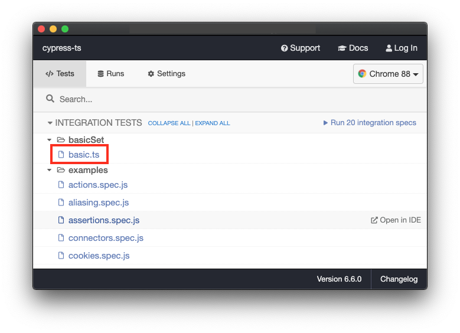

## Overview
**Cypress** is a great E2E testing tool. Here are a few great reasons to consider it:

- Isolated installation possible.
- Ships with TypeScript support out of the box (This means code completion and docs with VS Code)
- Provides a nice interactive google chrome debug experience. This is very similar to how UI devs mostly work manually.
- Has command - execution separation which allows for more powerful debugging and test stability 
- Has implicit assertions to provide more meaningful debug experience with less brittle tests
- Provides the ability to mock out and observe backend XHRs easily without changing your application code

Here is a [demo video](https://youtu.be/ZGEeve8MQiE) (7 minutes) showing basic cypress testing with google search verifying if search word is an adjactive. The github repository is [here](https://github.com/ltenfield/cypress-example-ts).

Here is a detailed comparison of **selenium** and **cypress** by [*Gil Tayar*](https://www.linkedin.com/in/giltayar/?originalSubdomain=il) a senior software architect explaining the testing pyramid and how it helps developers and testers explaining the different needs of each audience together with design motivations for each testing system. 

[](http://www.youtube.com/watch?v=D7vxFuwnUio)

## Limitations and Caveats
- Cypress supports some browsers like **Microsoft Edge**, **Firefox** and **Chrome** but the original implmentation is targeted for **Chrome**, that is **Firefox** most likely will not have the stability that **Chrome** offers. 
- Many browsers such as Safari and Internet Explorer are not currently supported. Support for more browsers is on our roadmap. You can read an explanation about our future cross browser roadmap [here](https://github.com/cypress-io/cypress/issues/310).
- A paid tier and possibly a web proxy will needed to run headless parrallel sessions. The web proxy is needed to make QA and staging visible from the internet.
- Within the paid tier the *Sprout* tier with 25,000 test recordings would be the minimum since 500 recording of the free tier will quickly be exceeded since you need a recording for every test run.  
- Also there can be no nested iframes or seperate browser tabs.
- You can see limitations and trade-offs [here](https://docs.cypress.io/guides/references/trade-offs.html#Permanent-trade-offs-1).

## Installation
Installation is well explained [here](https://basarat.gitbook.io/typescript/intro-1/cypress#installation), along with a youtube tutorial found within basarat's youtube channel with a video entitled [Quickly get started with Cypress E2E testing using TypeScript](https://www.youtube.com/watch?v=n3SvvZSWwfM)

## Running the test from launch window
1. Install `node` or `nvm` node version manager
2. Install node modules within root directory of this project
```sh
$ npm install
```
3. Launch cycpress in development mode
```sh
$ npx cypress open
```
Then you get an **Electron** launch window and you *double* click on the hilighted test file named `basic.ts`within the `basicSet` folder. Then the browser window opens and the test starts.


## Running the tests headless

```sh
$ npx cypress run
```
(Run Starting)

| | |
| - | - |
|Cypress: | 6.6.0 |
| Browser: | Electron 87 (headless) |
| Specs: | 1 found (basicSet/basic.ts |

  Running:  basicSet/basic.ts (1 of 20)

  - google search for agile (2714ms)
  - google search for proficient (2161ms)

  2 passing (6s)

  ## Cypress info

```sh
▶ npx cypress info
Displaying Cypress info...

Detected 2 browsers installed:

1. Chrome
  - Name: chrome
  - Channel: stable
  - Version: 88.0.4324.192
  - Executable: /Applications/Google Chrome.app/Contents/MacOS/Google Chrome
  - Profile: /Users/lawrence.turcotte/Library/Application Support/Cypress/cy/production/browsers/chrome-stable

2. Firefox
  - Name: firefox
  - Channel: stable
  - Version: 83.0
  - Executable: /Applications/Firefox.app/Contents/MacOS/firefox-bin

Note: to run these browsers, pass <name>:<channel> to the '--browser' field

Examples:
- cypress run --browser chrome
- cypress run --browser firefox

Learn More: https://on.cypress.io/launching-browsers

Proxy Settings: none detected
Environment Variables: none detected

Application Data: /Users/lawrence.turcotte/Library/Application Support/cypress/cy/development
Browser Profiles: /Users/lawrence.turcotte/Library/Application Support/cypress/cy/development/browsers
Binary Caches: /Users/lawrence.turcotte/Library/Caches/Cypress

Cypress Version: 6.6.0
System Platform: darwin (19.6.0)
System Memory: 34.4 GB free 700 MB
```
